<div align="center">

# 🚀 Minimax Connect BrowserOS

**Connect [BrowserOS](https://www.browseros.com/) agents to [MiniMax-M2.5](https://platform.minimax.io/) — the open-source AI browser meets peak-performance LLMs.**

[](LICENSE)

</div>

---

## 📖 Description

**Minimax Connect BrowserOS** is a toolkit that bridges [BrowserOS](https://www.browseros.com/) — the open-source agentic browser — with [MiniMax-M2.5](https://platform.minimax.io/) API. Use MiniMax's 204K context, 60+ tps throughput, and strong tool-calling in your BrowserOS workflows.

Three integration paths: **config generator**, **HTTP adapter**, and **native provider** — pick what fits your setup.

---

## 🏗 Architecture

```mermaid
flowchart TB
    subgraph User["👤 User"]
        BrowserOS[BrowserOS Browser]
        AgentUI[Agent UI / Chat]
    end

    subgraph Integration["🛠 Integration Options"]
        ConfigGen["1️⃣ Config Generator<br/>JSON for settings"]
        Adapter["2️⃣ Adapter Service<br/>HTTP Proxy :3100"]
        Native["3️⃣ Native Provider<br/>MiniMax in picker"]
    end

    subgraph Backend["Backend"]
        Server[BrowserOS Server<br/>Vercel AI SDK]
    end

    subgraph MiniMax["MiniMax API"]
        API["https://api.minimax.io/anthropic<br/>MiniMax-M2.5"]
    end

    BrowserOS --> AgentUI
    AgentUI --> Integration
    ConfigGen --> Server
    Adapter --> Server
    Native --> Server
    Server --> API
```



### Data Flow


---

## ✨ Features

| Feature | Description |
|---------|-------------|
| **Config Generator** | Output BrowserOS-compatible JSON for MiniMax (global & China regions) |
| **Adapter Service** | HTTP proxy for setups where direct provider config isn't available |
| **Native Provider** | MiniMax as first-class provider in BrowserOS-agent with full UI support |
| **Anthropic-Compatible** | Uses `@ai-sdk/anthropic` with base URL override — no custom client |
| **204K Context** | Full MiniMax-M2.5 context window (204,800 tokens) |

---

## 📦 Components

### 1️⃣ Config Generator (`browseros-minimax-config`)

Generates BrowserOS-compatible provider JSON for MiniMax-M2.5.

```bash
cd browseros-minimax-config
node index.ts                           # Print to stdout
node index.ts --api-key=YOUR_KEY        # With API key
node index.ts --region=china            # China endpoint
node index.ts --output=minimax.json     # Save to file
```

### 2️⃣ Adapter Service (`browseros-minimax-adapter`)

HTTP proxy that forwards BrowserOS requests to MiniMax. Use when you can't add MiniMax as a direct provider.

```bash
cd browseros-minimax-adapter
npm install
MINIMAX_API_KEY=your_key npm run start
```

Then in BrowserOS: add **OpenAI Compatible** provider with base URL `http://localhost:3100` and model `MiniMax-M2.5`.

### 3️⃣ BrowserOS-Agent Integration (`browseros-agent`)

MiniMax as a native provider with full Agent UI support.

| Path | Change |
|------|--------|
| `packages/shared` | MINIMAX in `LLM_PROVIDERS` |
| `apps/server` | `createMinimaxModel` in provider factory |
| `apps/agent` | MiniMax in provider picker (templates, icons) |

**Requires:** [Bun](https://bun.sh/)

```bash
cd browseros-agent
bun install
bun run start:server
```

In BrowserOS: **Settings → Add provider → MiniMax**

---

## 🚀 Quick Start

1. Get a [MiniMax API key](https://platform.minimax.io/user-center/basic-information/interface-key)
2. Choose your integration:
   - **Config** → Run generator, paste output into settings
   - **Adapter** → Start proxy, add OpenAI Compatible provider
   - **Native** → Use BrowserOS-agent with MiniMax in the picker
3. **China region:** use `--region=china` or `MINIMAX_BASE_URL=https://api.minimaxi.com/anthropic`

---

## 🖥 Running BrowserOS + Development Server

To run the **installed BrowserOS** with the **development server** (MiniMax integration):

1. **Launch BrowserOS with CDP** (use port 9222 — port 9000 is used by BrowserOS UI):
   ```powershell
   .\scripts\run-browseros.ps1
   ```
   Or manually: `chrome.exe --remote-debugging-port=9222`

2. **Start the server:**
   ```bash
   cd browseros-agent/apps/server
   $env:BROWSEROS_CDP_PORT=9222
   bun --env-file=.env.development start
   ```

3. **Verify:** Open http://localhost:9100/health → `{"status":"ok"}`

The server connects to BrowserOS via CDP and exposes chat/MCP at port 9100.

---

## 📁 Repository Structure

```
Minimax-Connect-BrowserOS/
├── browseros-minimax-config/    # Config generator CLI
├── browseros-minimax-adapter/   # HTTP proxy service
├── browseros-agent/             # Fork with MiniMax provider
├── scripts/                     # run-browseros.ps1 launcher
├── docs/plans/                  # Implementation plans
└── README.md
```

---

## 🔗 Links

- [BrowserOS](https://www.browseros.com/) — Open-source agentic browser
- [MiniMax Platform](https://platform.minimax.io/) — API keys & docs
- [MiniMax M2.5 for AI Tools](https://platform.minimax.io/docs/guides/text-ai-coding-tools)
